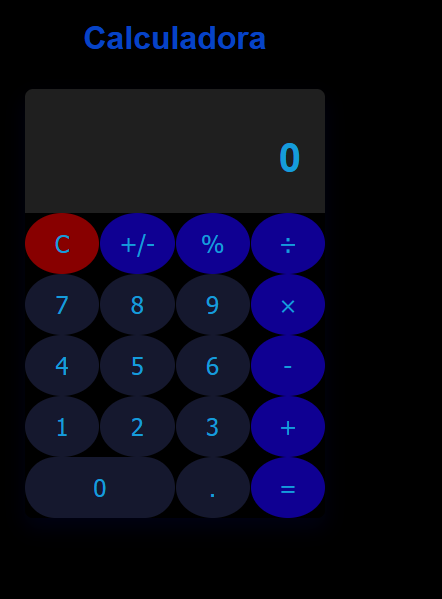

# Calculadora React Avanzada 🧮

[](https://standardjs.com)
[](https://vitest.dev)

Calculadora interactiva con pruebas unitarias, historias de Storybook y cumplimiento de estándares de código.




## Características Clave 
- Operaciones básicas: `+`, `-`, `×`, `÷`, `%`
- Manejo de errores para:
  - Números negativos (muestra `ERROR`)
  - Límite de 9 dígitos
  - Overflow (>999,999,999)
- Componentes modulares:
  - `<Display>`: Pantalla con formato dinámico
  - `<Keypad>`: Teclado numérico interactivo
  - `<Button>`: Botones reutilizables
- pruebas unitarias
-  historias de Storybook
- Custom Hook: `useCalculator` para lógica central

## Tecnologías Utilizadas 🛠
- **React 18** + Vite
- **Vitest** + Testing Library
- **Storybook 7**
- JavaScript Standard Style (sin puntos y coma)

## Instalación y Uso 

```bash
# 1. Clonar repositorio
git clone https://github.com/DiegoLinares11/Proyecto-Calculadora
cd calculadora-react

# 2. Instalar dependencias
npm install

# 3. Modos de ejecución:
npm run dev          # Inicia servidor de desarrollo
npm run build        # Crea versión de producción
npm test             # Ejecuta pruebas unitarias
npm run lint         # Verifica estándares de código
npm run storybook    # Abre Storybook (http://localhost:6006)

```
Estructura del Proyecto 
```bash
src/
├── components/      # Componentes UI
│   ├── Button.jsx   # Botón reutilizable
│   ├── Display.jsx  # Pantalla de calculadora
│   ├── Keypad.jsx   # Teclado numérico
│   └── Calculator.jsx # Componente principal
├── hooks/
│   └── useCalculator.js # Lógica de negocio
├── tests/           # Pruebas unitarias
├── stories/         # Historias de Storybook
public/              # Assets estáticos
```
